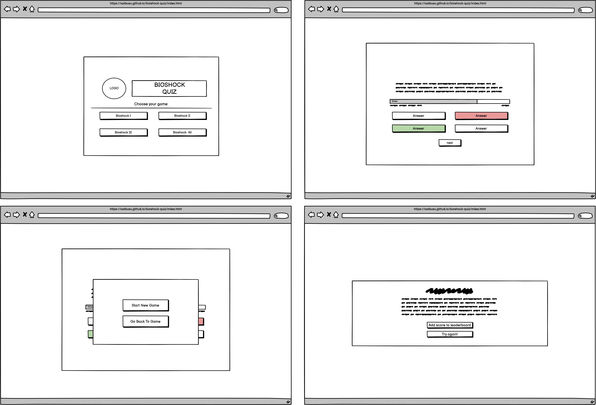
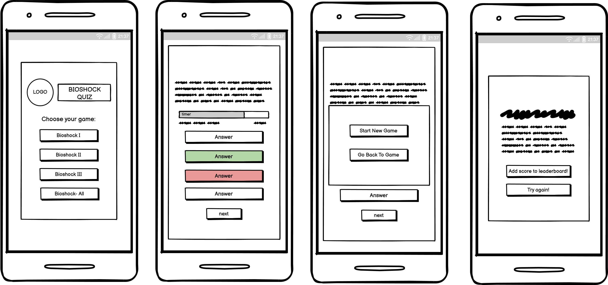
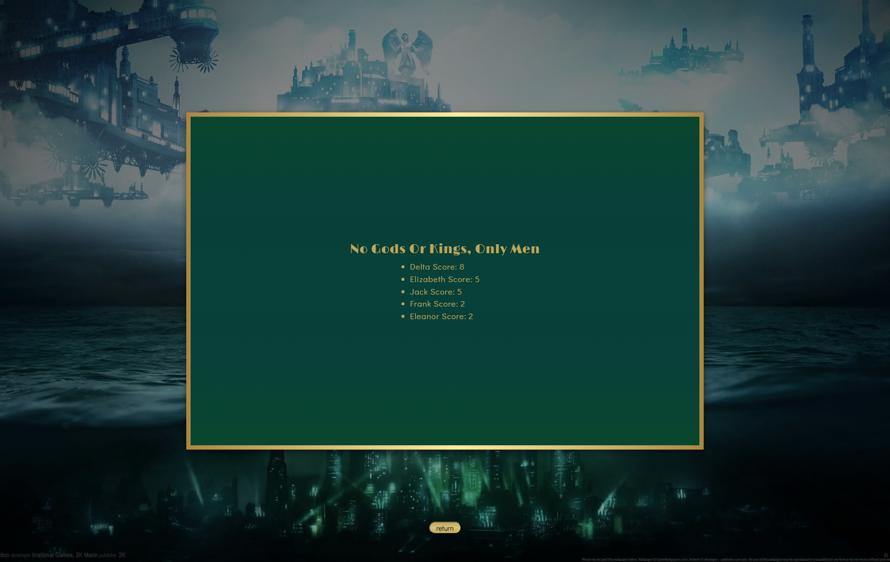

# Bioschok Quiz

You think you know your game, then let's proof it!

The Bioshock Quiz is a fun little game that quizzes the user about their Bioshock knowdledge. Hence this quiz is for people who played at least one game out of the series and want to test themselves on what they picked up from it. The goal is to answer as many questions correctly as possible. 

The Bioshock games have captivated millions of players all around the world. Yet they are dried out of new content. What better way is there to spend the time waiting for new game, than to refresh everything you know about the series and proof that you are worthy for new content. 

As many people that have become tired of waiting for Judas or a new Bioshock games and replaying the old games yearly, I wanted to pay my respect to my favourite video game (Bioshock II) and its series. This quiz is also a fun thing to use when spending time with friends, from which everyone thinks they know the most about this game.

Interested? Then check it out here: [Bioshock Quiz](https://xakkusu.github.io/bioshock-quiz/index.html)

## Contents
- [SITE OWNER GOALS](#site-owner-goals)
- [USER EXPERIENCE (UX)](#user-experience-ux)
- [WIREFRAMES](#wireframes)
- [FINAL DESIGN](#final-design)
    - [Imagery](#imagery)
    - [Color Scheme](#color-scheme)
    - [Typography](#typography)
    - [Visual Effects](#visual-effects)
    - [Final Look](#final-look)
- [FEATURES](#features)
    - [Index Page](#index-page)
    - [Quiz Page](#quiz-page)
    - [404 Page](#404-page)
    - [Future Features](#future-features)
- [TESTING](#testing)
    - [Accessibility](#accessibility)
    - [W3C Validators](#w3c-validators)
    - [JSHint](#jshint)
    - [Form Testing](#form-testing)
    - [Links Testing](#links-testing)
    - [Browser Testing](#browser-testing)
    - [Device Testing](#device-testing)
    - [User Stories Testing](#user-stories-testing)
    - [Fixed Bugs](#fixed-bugs)
- [TECHNOLOGIES USED](#technologies-used)
    - [Languages](#languages)
    - [Frameworks, Libraries and Programs used](#frameworks-libraries-and-programs-used)
- [DEPLOYMENT](#deployment)
- [CREDITS](#credits)
    - [Media](#media)
    - [Resources](#resources)
- [ACKNOWLEDGEMENTS](#acknowledgements)
## SITE OWNER GOALS
- to provide the user with a fun short quiz mainly for Bioshock/gaming fans with increasingly more difficult questions
- to provide the user the opportunity to test oneself on game knowdledge depending on the different Bioshock games (I-III)
- to provide the user with a website with a familiar syling and theme of the games
- to provide the user with the ability to gain more knowledge in case they didn't achieve the score they wanted

## USER EXPERIENCE (UX)
#### First Time User Goals
- I want to take a Bioshock quiz to test my knowledge
- I want to understand the website, its structure and how to take the quiz
- I want the quiz to be easy to use and navigate
- I want to take the quiz whenever, whereever
- I want to take the test on whichever device

#### Returning User Goals
- I want to be able to choose between different types of quizes
- I want to be able to improve my knowledge of the Bioshock series

#### Frequent User Goals
- I want to be able to choose between different types of quizes
- I want to be able to improve my knowledge of the Bioshock series
- I want to be able to see my score of the quiz outside of taking the quiz

## WIREFRAMES
Wireframes were produced using Balsamiq. 

 

 
Desktop Wireframe

Index Page:

Quiz Page:

404 Page:

 

 

    
Mobile Wireframe

Index Page:

Quiz Page:

404 Page:

## FINAL DESIGN
### Imagery
The imagery as well as the colour scheme were chosen to be as in synch with Bishock's main theme, especially menu looks, as possible. This is of great importance so the user will quickly associate its looks and design with the common themes in the game. This was done to be in line with all three games, however since two of the three games have a greatly different tone than Bioshock II the former dominated the most decisions.
The Background image was chosen to represent all three games. From the underwater world to the city in the clouds everything should be included for the main look  so the theme is easy to conntect with the games and is credited below.
An Artdeco style for the main content boxes were chosen to be in line with Bioshock I and II Artdeco styling of its in-game-world and its menu styling.

### Color Scheme

The main colors consist out of darker green colours as well es brighter gold and silver colors for highlights. Other minor colors were mainly used for gradient styling of buttons and the countdown bar. All colors are in line with the colors of the games so the user will be familiar with the color palette and connect the quiz to the games just by the look of it. The only colors of this scheme that stand out are the red and green colors chosen for wrong and right answers in the quiz. However, as brighter colours in Bioshock Infinite are in pastel tones I chose a pastel tones for these two colors as well to again stay in line of the games colour scheme.

The color palette was created by using the [coolors](https://coolors.co/) website.

### Typography
[Google Fonts](https://fonts.google.com/) was used for the following fonts:
-  
[Limelight](https://fonts.google.com/specimen/Limelight?query=Limelight) was chosen for all the headings to set them apart from the other content. The font was chosen as it closely resembles some fonts used in the games, therefore it stays in line of the game's styling.
-  
[Didact Gothic](https://fonts.google.com/specimen/Didact+Gothic?query=Didact+Gothic) was used for all the other text elements as it is easy to read and still resembles some fonts used in the Bioshock games.
- Sans Serif was chosen as a backup font, in case for any reason the main font isn't being imported into the site correctly.

### Visual Effects
Images and more information for these effects are given below in the [Features](#features) part.
#### Shadows
All elements that are shown in content boxes have a shadow to differentiate them either from the background image or from its content part that lay below it (e.g.: when clicking outside the game box while playing it).
#### Buttons Hover Effect
On larger screens when placing the mouse above any kind of button a hover-effect will appear. The shadow will change its opacity and color to a brighter gold to make it stand out. The cursor will become a pointer as well, unless it its in the quiz section and an answer has already been chosen.
#### Answer Buttons Wrong/Right
When the user chose an answer the right answer will change colors to green, the wrong to a red both with a silver font color to easily indicate which is wrong and which would have been correct. 
#### Next Button
In the quiz section the next button will only appear after the user chose an answer.
#### Countdown Bar
In the quiz section there is a time-bar to indicate to the user the decreasing time to answer each question.

### Final Look

Desktop

Index Page:

Quiz Page:

404 Page:

Mobile

Index Page:

Quiz Page:

404 Page:

## FEATURES
The Bioshock Quiz consists of the landing page (index), the quiz page and a 404 error page.

All pages have the following in common:
#### Favicon

#### Heading and Logo

- Is a link, can be clicked and will redirect the user to the landing page.

#### Button Hover Effect

- Only on larger screens when placing the mouse above a button the shadow will change color and have a higher opacity. 
- The cursor will change to a pointer as well
- This is done to indicate to the user that something is different and can be clicked compared to the other content.

### Index Page

- The landing page has a simple design that is similar to various quiz websites as well as, due to its design, is similar to other Bioshock content.
- The section is made up out of the Logo, an input field and 4 buttons that are selectable by the user.
- The whole section is responsive and will adapt according to screen size. When using a larger smartphone horizontally some of the buttons will appear next to one another instead of being stacked on top of each other.

#### Name Input and Start Game field

- The user has to input a name in order to start the quiz.
- The user can start the quiz after entering the name either by pressing the "Enter" key or selecting the "Let's Play"- Button by being directed to the quiz.html.

- If the user tries to start the quiz without entering a name the alert: "Enter a name to start" is shown. This is done to prevent starting a game without leaving a name first.

- When focused the input field's border will change color so the user will know better that they can enter a name now.

- After entering a name and submitting it via the button a message appears: "Hi XY let the game begin".
- This is done only via button because if the user will be on his mobile device entering their name via the enter key, I did not want more things than necessary on a smaller screen so they will be directly directed to the quiz page.

#### How to Play - Pop-Up

- If the user selects the "How to Play?" button an instruction-section will appear.
- The user is informed through this on how the game works and how to navigate the quiz-website overall.
- The user can select the "return"-button anytime they like to return to the landing page. The user could also click on the greyed out part outside of the section to go back to the landing page.

#### Leaderboard - Pop-Up 

- If the user selects the "Leaderboard" button an leaderboard-section will appear.
- The user will see either an empty leaderboard or if the played before the will see their name and if the back then dedcided to save the score the score will also be shown.
- The user can select the "return"-button anytime they like to return to the landing page. The user could also click on the greyed out part outside of the section to go back to the landing page.

#### Need more knowledge Button 

- Of the user selects the "Need more knowldge button" they will be transfered to the [Bioshock Wiki](https://bioshock.fandom.com/wiki/BioShock_Wiki) in an external tab.
- Here they can look up whatever they think they lack knowledge in.

### Quiz Page

- The quiz page has a nearly identical design to the index page, so the user should already be familiar with how it works.
- The section is made up out of the Logo and 4 buttons that are selectable by the user. When chosing a button a pop-up with the according quiz will appear.
- The whole section is responsive and will adapt according to screen size. On smaller smartphones and smaller tabletes the buttons will be stacked on top of each other. When using a larger smartphone horizontally or a larger desktob screen the buttons will appear next to one another in two rows.

#### Game Section Pop-Up

- This section consists out of the quiz itself and only pops up when a game type has been selected.
- It is made up out of the question, a countdown-bar, a timer, answer-buttons and if certain conditions are fullfilled a score and a next-button.

- The whole section is responsive and will adapt according to screen size. On smaller smartphones and smaller tabletes the answer-buttons will be stacked on top of each other.

#### Timer, Timebar, Questions Left, Score

- A Timer that counts down from 20 seconds is shown within a countdown bar which also runs down. This indicates to the user in a simple visual way how much time they have left to anser a certain question.
- A counter how many questions are left to be asked is given as well.
- When the user has not answered a question correctly only this information is given in this part.

- When the user has answered a question correctly the timer will stop its countdown at this point until the next question will be loaded in. 
- In this part a score-counter will appear as well. This way the user is always informed about all relevant game-related data.

#### Answers

- The buttons have the same hover-effect as every other button, however they are styled in different colors to set themselves apart from the others. This is done to visually indicate to the user that this part of the website is different than the other parts as it is the quiz itself.
- The answer's order is random through the Fisher–Yates shuffle.
- After the user selected an answer the selected button will either turn green with a white font or it will turn red and the correct answer will turn green. 
- This reveal of the correct and false answer is commonly done in quizes and other games to indicte to the user what they have done wrong or correct.
- The whole section is responsive and will adapt according to screen size. On smaller smartphones and smaller tabletes the answer-buttons will be stacked on top of each other.

- If an answer has been chosen the other ones cannot be selected anymore which is indicated visually as well by the cursor having the no-drop value.

#### Next Button

- When the user has not selected an answer yet there will be no next button.
- As soon as the user clicked on an answer-button the next button will appear below the answers. This way the user can only go to the next question after they selected an answer.
- If the time is up the next button will appear as well as the correct-answer will be shown in green as well to the user.
- The user can only chose the next button or click outside the game-window and another pop-up will appear.

#### Game Pause Section

- When playing the game and clicking outside the game window a pop-up will appear giving the user the two options to either keep playing or starting the game new. The user has hence always the chance to end the quiz whenever they like.
- Starting a new game will redirect the user to the beginning quiz page and they can choose again which quiz they want to start.
- Having this Pause Window open will pause the timer as well and resume when selecting the according button.

#### End of Game Section

- After going through all questions when selection the last next button an end of game pop-up will appear.
- This tells the user that the quiz is finished, their name and their final score.
- The user can then choose whether they would play a quiz again or wanting to add their score to the leaderboard. The first option will redirect the user at the beginning of the quiz page and the second will redirect the user to the landing page where they can choose to see the leaderboard with their score.

### 404 Page

### Future Features
- good Database for scoreboard
## TESTING
### Accessibility
### W3C Validators
### JShint
### Links Testing
### Browser Testing
The website was successfully tested on the following browsers:
- Google Chrome
- Mozilla Firefox
- Safari
- Microsoft Edge

### Device Testing

- The following websites, besides google dev tools, were used to check responsiveness:
    - [Am I Responsive - Index Page](https://ui.dev/amiresponsive?url=https://xakkusu.github.io/bioshock-quiz/index.html)
    - [Am I Responsive - Quiz Page](https://ui.dev/amiresponsive?url=https://xakkusu.github.io/bioshock-quiz/quiz.html)
    - [Am I Responsive - 404 Page](https://ui.dev/amiresponsive?url=https://xakkusu.github.io/bioshock-quiz/404.html)
    - [Responsinator - Index Page](http://www.responsinator.com/?url=https%3A%2F%2Fxakkusu.github.io%2Fbioshock-quiz%2Findex.html)
    - [Responsinator - Quiz Page](http://www.responsinator.com/?url=https%3A%2F%2Fxakkusu.github.io%2Fbioshock-quiz%2Fquiz.html)
    - [Responsinator - 404 Page](http://www.responsinator.com/?url=xakkusu.github.io%2Fbioshock-quiz%2F404.html)

### User Stories Testing
### Fixed Bugs
### Known Bugs
## TECHNOLOGIES USED
### Languages
### Frameworks, Libraries and Programs used
- [Balsamiq](https://balsamiq.com/wireframes/)- Used to create wireframes.
- [GitHub](https://GitHub.com/) - Used for version control and hosting.
- [Gitpod](https://gitpod.io/) - IDE to develop the website.
- [Google Fonts](https://fonts.google.com/) - Used to import  fonts used on website.
- [FontAwesome](https://fontawesome.com/) - Used for footer's and navbar's icon.
- [Google Chrome Dev Tools](https://developers.google.com/web/tools/chrome-devtools)- Used for troubleshooting, debugging, inspecting page's elements, testing responsiveness and styling elements.
- [Favicon.cc](https://www.favicon.cc/) - Used for website's favicon.
- [Coolors](https://coolors.co/) - Used to create color palette.
- [Google Chrome's Lighthouse](https://developers.google.com/web/tools/lighthouse) - Used to test performance and accessibility.
- [Wave](https://wave.webaim.org/) Used to test accessibility.
- [W3C HTML Markup Validator](https://validator.w3.org/) Used to validate HTML code.
- [W3C Jigsaw CSS Validator](https://jigsaw.w3.org/css-validator/) Used to validate CSS code.
- [JSHint](https://jshint.com/) Used to test all Javascript code.
- [Am I Responsive](https://ui.dev/amiresponsive) Used to test responsiveness.
- [Responsinator](http://www.responsinator.com/) Used to verify responsiveness especially usage for mobile devices.

## DEPLOYMENT
The steps to deploy this project using GitHub pages were the following:
1. Go to the Settings tab of your GitHub repository.
2. On the left-hand sidebar, in the Code and automation section, select "Pages".
3. Make sure to select the following:
    - Source is set to 'Deploy from Branch'.
    - Main branch is selected.
    - Folder is set to / (root).
4. Click Save next to /root.
5. "Your GitHub Pages site is currently being built from the main branch." shows up.
6. Go back to the Code tab. Wait a few minutes for the build to finish and refresh your repository where a Deployments section will show the deployed project.

The live link can be found here - [Bioshock Quiz](https://xakkusu.github.io/bioshock-quiz/index.html)

How to run the project locally:

Fork the repository:
- Log in (or sign up) to Github.
- Go to the repository for: Xakkusu/bioshock-quiz.
- Click the Fork button in the top right corner.

#### Clone repository:
1. Log in (or sign up) to GitHub.
2. Go to the repository for: Xakkusu/bioshock-quiz.
3. Click on the code button, select whether you would like to clone with HTTPS, SSH or GitHub CLI and copy the link shown.
4. Open the terminal in your code editor and change the current working directory to the location you want to use for the cloned directory.
5. Type 'git clone' into the terminal and then paste the link you copied in step 3. Press enter.
6. A clone of the repository will now be created on your machine.

## CREDITS
### Media
### Resources
## ACKNOWLEDGEMENTS
